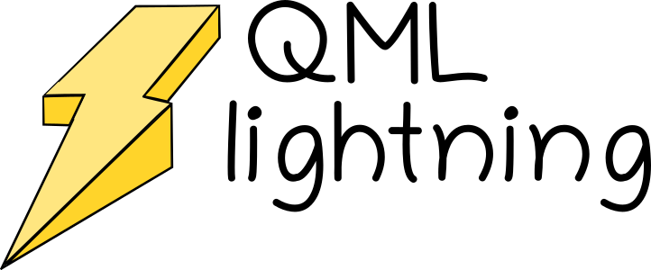

<div style="text-align:center"></div>

# QML-Lightning!

GPU-Accelerated Approximate Kernel Methods and Representations for Quantum Machine Learning. 


# Requirements

```
pytorch
numpy
scipy
tqdm
h5py
cuda C compilers and runtime libraries, e.g https://developer.nvidia.com/cuda-downloads
```

# Installation

cd to the directory containing setup.py and type

```bash
python3 setup.py build
```

if you've got multiple versions of CUDA, you may need to prepend the LDFLAGS variable to let nvcc know where to find the correct CUDA libraries, eg:

```bash
LDFLAGS=-L/usr/local/cuda-11.4 python3 setup.py build
```

The above may also apply if you're using an environment manager, e.g conda/miniconda. Alternatively, you can make sure your LD_LIBRARY_PATH is set correctly. Once built, set `PYTHONPATH` to the following build directory, e.g in your `.bashrc` file:

```bash
export PYTHONPATH=/path/to/qml_lightning/build/lib.XXX:$PYTHONPATH
```

Finally, QML-Lightning uses the TorchScript C++ API to enable model loading compatibility with the OpenMM-QML-Lightning plugin. All classes rely on a setup script located here:

```
/qml_lightning/torchscript/setup.py
```

which loads the compiled QML-Lightning TorchScript libraries for use in other modules. You'll need to set the following environment variable:

```bash
export QML_LIGHTNING_TORCHSCRIPT_LIB=/path/to/qml_lightning/build/lib.XXX/qml_lightning:$PYTHONPATH
```

Note that the TorchScript libraries (torchscript_fchl19.sp and torchscript_sorf.so) are located in the main qml_lightning/ folder.


Source your .bashrc and you should be good to go!

# Use

First, download the datasets by typing the following command in the `examples/` folder

```
bash get_data.sh
```

This will download the MD9 datasets, as well as the QM9 dataset and provide you with the link to the 3BPA dataset. Examples for various datasets are provided in the qml_lightning/examples folder. In this example we'll use the MD17 dataset with Hadamard features located here: `examples/MD17/train_md17_sorf.py`


now run the following command to do some ML, learning only energies + forces:

```python
python3 train_md17_sorf.py -ntrain 1000 -nstacks 128 -npcas 128 -sigma 2.0 -llambda 1e-5
```

The total number of features used to approximate the kernel model is given by nstacks x npcas. The variable npcas represents the dimension of the projected FCHL19 representation, and nstacks represents the number of times (i) this lower-dimensional representation is repeated (and multiplied with D_i and transformed via fast HT). The variable npcas must be a multiple of 2, while nstacks can take any number limited by your GPUs VRAM. 

# Model Saving/Loading

The python wrappers to the CUDA C code fully supports TorchScript, which makes saving and loading models very straightforward. For both RFF and SORF models, the models can be saved with the following call:

```python
model.save_jit_model()
```

which will create a `model.pt` file in the current working directory. This model can then be loaded again using:

```python
from qml_lightning.torchscript import setup 

loaded = torch.jit.load('model_rff.pt')
    
energy_prediction = loaded.forward(X, Z, atomIDs, molIDs, atom_counts)
forces_prediction, = torch.autograd.grad(-energy_prediction.sum(), X)
```

where the setup script has been imported to load the correct QML Lightning torchscript libraries. Note that the `X, Z, atomIDs, molIDs, atom_counts` variables are all pytorch Tensors residing on the GPU. These have the following shapes and types:

```python
X: [Nbatch, max_atoms, 3], dtype=torch.float32
Z: [Nbatch, max_atoms], dtype=torch.float32
molIDs: [total_atoms], dtype=torch.int
atomIDs: [total_atoms], dtype=torch.int
atom_counts: [Nbatch], dtype=torch.int
```

For multiple-molecule inputs to the forward function, `max_atoms` refers to the maximum number of atoms for any molecule in the batch. The elements of the vectors `molIDs` and `atomIDs` provide the indexes to map each atom in the batch to the correct atom within each input molecule. For example, for the two molecules:

``` 
H    0.0 			0.0 		   0.74
H    0.0 			0.0 		   0.0
---
H    0.7493682    0.0000000    0.4424329
O    0.0000000    0.0000000   -0.1653507
H   -0.7493682    0.0000000    0.4424329
```

the `molIDs` and `atomIDs` vectors should be:

```
atomIDs = torch.tensor([0, 1, 0, 1, 2], dtype=int, device='cuda')
molIDs = torch.tensor([0, 0, 1, 1, 1], dtype=int, device='cuda')
```

For a code example of this, please see the method `format_data` in `qml_lightning/models/kernel.py`.


# Notes

The code is structured such that all of the CUDA C implementational details are hidden away in the two BaseKernel subclasses: RandomFourrierFeaturesModel and HadamardFeaturesModel. The CUDA C implementation of the FCHL19 representation is wrapped by the FCHLCuda class. Consequently, training models with this code is incredibly straightforward and is performed in a few lines:

```python
rep = FCHLCuda(species=unique_z, rcut=rcut, nRs2=nRs2, nRs3=nRs3, eta2=eta2, eta3=eta3,
                   two_body_decay=two_body_decay, three_body_decay=three_body_decay, three_body_weight=three_body_weight)
    
model = HadamardFeaturesModel(rep, elements=unique_z, sigma=sigma, llambda=llambda,
                                nstacks=nstacks, ntransforms=ntransforms, npcas=npcas,
                                nbatch_train=nbatch_train, nbatch_test=nbatch_test)
    
model.get_reductors(train_coordinates, train_charges, npcas=npcas)
    
model.set_subtract_self_energies(True)
model.self_energy = torch.Tensor([0., -13.587222780835477, 0., 0., 0., 0., -1029.4889999855063, -1484.9814568572233, -2041.9816003861047]).double()
  
model.train(train_coordinates, train_charges, train_energies, train_forces)
    
data = model.format_data(test_coordinates, test_charges, test_energies, test_forces)

test_energies = data['energies']
test_forces = data['forces']
max_natoms = data['natom_counts'].max().item()

energy_predictions, force_predictions = model.predict(test_coordinates, test_charges, max_natoms, forces=True)
```

The BaseKernel subclasses expect python lists of numpy ndarrays containing the relevant input data. These are then converted to torch CUDA tensors internally by the format_data method. This method is not optimised and should not be used for timing benchmarks. Note that this method uses zero padding when relevant for datasets containing molecules with different sizes. In the above example, the train_coordinates, train_energies and train_forces python lists might have the following structure:

```
train_coordinates: [ndarray(5, 3), ndarray(11,3), ndarray(21,3)...]
train_charges: [ndarray(5), ndarray(11), ndarray(21)]
train_energies: [-1843.3, -1024.1, -765.4]
train_forces: [ndarray(5, 3), ndarray(11,3), ndarray(21,3)...]
```

# Caveats

Since Hadamard transforms have dimension 2^{m}, where m is a positive integer, the representation also needs to be this length. This is achieved using an SVD on a subsample of the atomic representations. Examples of this are provided in the tests folder.

For learning size-extensive properties, I recommend subtracting the atomic contributions (e.g single-atom energies) from the total energy. The code can automatically do this for you with the following call:

```python
model.set_subtract_self_energies(True)
model.self_energy = torch.Tensor([0., -0.500273, 0., 0., 0., 0., -37.845355, -54.583861, -75.064579, -99.718730]).double() * 627.5095
```

where self_energy is a torch Tensor that has shape (max(elements) + 1). If these single-atom properties are unavailable, you can tell the code to linearly fit them for you:

```python
model.set_subtract_self_energies(True)
model.calculate_self_energy(train_charges, train_energies)
````

# Citation

Please cite the following archive if you use or derive from this work.

```
https://arxiv.org/abs/2206.01580
```

```
@misc{https://doi.org/10.48550/arxiv.2206.01580,
  doi = {10.48550/ARXIV.2206.01580},
  
  url = {https://arxiv.org/abs/2206.01580},
  
  author = {Browning, Nicholas J. and Faber, Felix A. and von Lilienfeld, O. Anatole},
  
  keywords = {Chemical Physics (physics.chem-ph), FOS: Physical sciences, FOS: Physical sciences},
  
  title = {GPU-Accelerated Approximate Kernel Method for Quantum Machine Learning},
  
  publisher = {arXiv},
  
  year = {2022},
  
  copyright = {Creative Commons Attribution 4.0 International}
}
```
